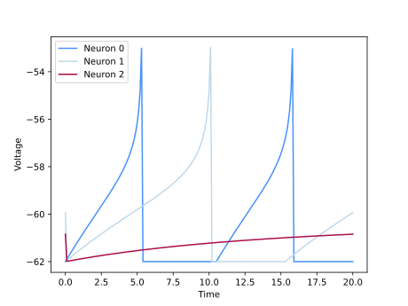
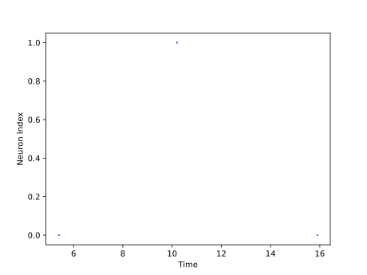

<script type="text/javascript" src="https://www.maths.nottingham.ac.uk/plp/pmadw/LaTeXMathML.js"></script>
<script src='https://cdnjs.cloudflare.com/ajax/libs/mathjax/2.7.4/MathJax.js?config=default'></script>


# AELIF

## Introduction
The Adaptive Exponential Leaky Integrate-and-Fire (AELIF) model is an extension of the basic LIF model, incorporating additional features to represent the complex behavior of biological neurons better. The adaptive component allows the model to adjust the firing threshold in response to changes in input statistics, making it more biologically plausible and suitable for modeling neural systems that exhibit adaptive behavior. The AELIF model has been used to study a wide range of phenomena in neuroscience, including sensory processing, learning and memory, and the mechanisms underlying neurological disorders. Its flexibility and ability to capture the dynamics of biological neurons make it a valuable tool for understanding the intricate workings of the brain.

<br>

## How does it work?
The AELIF neuron is a modified version of the ELIF model that includes spike frequency adaptation (SFA). This adaptation mechanism allows the neuron to adjust its firing rate in response to changes in input. The membrane equation for the AELIF model can be expressed as:

$$
\begin{align*}
\\
\tau_m\frac{du}{dt}\ = -[u(t) - u_{rest}] + \Delta_T exp(\frac{u(t) - \theta_{rh}}{\Delta_T}) - R\sum_{k} w_k + RI(t) \\
\end{align*}
$$

where the exponential term with time constant $\Delta_T$ is responsible for the adaptation of the neuron, $\theta_{rh}$ is the rheobase threshold, and $\Delta_T$ is the slope factor. The AELIF model also includes a set of adaptation currents $w_k$, which are controlled by the following equation:

$$
\begin{align*}
\\
\tau_k\frac{dw_k}{dt}\ = a_k (u - u_{rest}) - w_k + b_k\tau_k \sum_{t^{(f)}} \delta (t - t^{(f)})
\\
\end{align*}
$$

where $\tau_k$ is the time constant of the $k^{th}$ adaptation current, $a_k$ and $b_k$ control the amplitude and decay rate of the adaptation current, respectively, the adaptation current is incremented by $b_k$ every time an action potential is fired at time $t^{(f)}$.

<br>

## Strengths:
<li>AELIF model provides a more realistic representation of biological neurons that can adapt their firing rates in response to changing input patterns, making it suitable for modeling neural plasticity and learning.
<li>AELIF model has a low computational cost and can simulate large-scale neural networks efficiently.

<br>

## Weaknesses:
<li>AELIF model is a simplification of biological neurons and, therefore, may only capture some of the complexities of neural dynamics.
<li>AELIF model requires the tuning of several parameters to match experimental data, which can be time-consuming and difficult.

<br>

## Usage
AELIF Population model can be used by the given code:
```python
from synapticflow.network import neural_populations
model = neural_populations.AELIFPopulation(n=10)
```
Then you can stimulate each time step by calling the `forward` function:
```python
model.forward(torch.tensor([10 for _ in range(model.n)]))
```
All available attributes like spike trace and membrane potential is available by `model` instance:
```python
print(model.s) # Model spike trace
print(model.v) # Model membrane potential
```

 And in the same way, you can use the visualization file to draw plots of the obtained answer:

<p align="center">
  
  
</p>

<br>
 
## Parameters:

  <b>n</b> (<span style="color: #2b8cee; font-style: italic; font-weight: 400;">int, optional</span>) - <span style="font-weight: 400;">Number of neurons in this layer.</span>

  <b>shape</b> (<span style="color: #2b8cee; font-style: italic; font-weight: 400;">Iterable[int], optional</span>) - <span style="font-weight: 400;">Shape of the input tensor to the layer.</span>

  <b>spike_trace</b> (<span style="color: #2b8cee; font-style: italic; font-weight: 400;">bool, optional</span>) - <span style="font-weight: 400;">Indicates whether to use synaptic traces or not.</span>

  <b>additive_spike_trace</b> (<span style="color: #2b8cee; font-style: italic; font-weight: 400;">bool, optional</span>) - <span style="font-weight: 400;">If true, uses additive spike traces instead of multiplicative ones.</span>

  <b>tau_s</b> (<span style="color:#2b8cee; font-style: italic; font-weight: 400;">float or torch.Tensor, optional</span>) - <span style="font-weight: 400;">Decay time constant for spike trace. Default : `10`</span>

  <b>tau_w</b> (<span style="color:#2b8cee; font-style: italic; font-weight: 400;">Union[float, torch.Tensor], optional</span>) - <span style="font-weight: 400;">Adaptation time constant.</span>

  <b>a0</b> (<span style="color:#2b8cee; font-style: italic; font-weight: 400;">Union[float, torch.Tensor], optional</span>) - <span style="font-weight: 400;">Parameter used in calculating adaptation current.</span>

  <b>b</b> (<span style="color:#2b8cee; font-style: italic; font-weight: 400;">Union[float, torch.Tensor], optional</span>) - <span style="font-weight: 400;">Parameter used in calculating adaptation current.</span>

  <b>theta_rh</b> (<span style="color:#2b8cee; font-style: italic; font-weight: 400;">Union[float, torch.Tensor], optional</span>) - <span style="font-weight: 400;">A float or tensor representing the resting potential value for neuron model.</span>
  
  <b>delta_T</b> (<span style="color:#2b8cee; font-style: italic; font-weight: 400;">Union[float, torch.Tensor], optional</span>) - <span style="font-weight: 400;">A float or tensor representing sharpness of the neuron's voltage threshold.</span>
        
  <b>threshold</b> (<span style="color:#2b8cee; font-style: italic; font-weight: 400;">float or torch.Tensor, optional</span>) - <span style="font-weight: 400;">The spike threshold of the neuron.</span>

  <b>rest_pot</b> (<span style="color: #2b8cee; font-style: italic; font-weight: 400;">float or torch.Tensor, optional</span>) - <span style="font-weight: 400;">The resting potential of the neuron.</span>

  <b>reset_pot</b> (<span style="color: #2b8cee; font-style: italic; font-weight: 400;">float or torch.Tensor, optional</span>) - <span style="font-weight: 400;">The reset potential of the neuron.</span>

  <b>refrac_length</b> (<span style="color: #2b8cee; font-style: italic; font-weight: 400;">float or torch.Tensor, optional</span>) - <span style="font-weight: 400;">The refractory period length of the neuron in timesteps.</span>

  <b>dt</b> (<span style="color: #2b8cee; font-style: italic; font-weight: 400;">float, optional</span>) - <span style="font-weight: 400;">The time step length.</span>

  <b>lower_bound</b> (<span style="color: #2b8cee; font-style: italic; font-weight: 400;">float, optional</span>) - <span style="font-weight: 400;">Minimum value for the membrane potential of the neuron.</span>

  <b>sum_input</b> (<span style="color: #2b8cee; font-style: italic; font-weight: 400;">bool, optional</span>) - <span style="font-weight: 400;">If true, sums input instead of averaging it.</span>

  <b>trace_scale</b> (<span style="color: #2b8cee; font-style: italic; font-weight: 400;">float, optional</span>) - <span style="font-weight: 400;">Scaling factor for the synaptic traces.</span>

  <b>is_inhibitory</b> (<span style="color: #2b8cee; font-style: italic; font-weight: 400;">bool, optional</span>) - <span style="font-weight: 400;">Indicates whether the neuron is inhibitory or not.</span>

  <b>R</b> (<span style="color: #2b8cee; font-style: italic; font-weight: 400;">Union[float, torch.Tensor], optional</span>) - <span style="font-weight: 400;">The time constant of the neuron voltage decay.</span>

  <b>learning</b> (<span style="color: #2b8cee; font-style: italic; font-weight: 400;">bool, optional</span>) - <span style="font-weight: 400;">Indicates whether the neuron should update its weights during training.</span>


## Reference
<li> Gerstner, Wulfram, et al. Neuronal dynamics: From single neurons to networks and models of cognition. Cambridge University Press, 2014.
