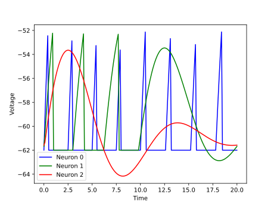
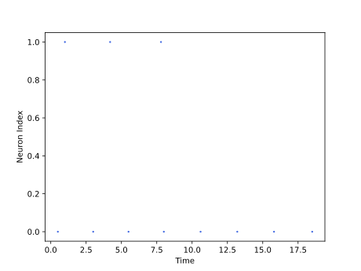

<script type="text/javascript" src="https://www.maths.nottingham.ac.uk/plp/pmadw/LaTeXMathML.js"></script>
<script src='https://cdnjs.cloudflare.com/ajax/libs/mathjax/2.7.4/MathJax.js?config=default'></script>


# ALIF

## Introduction
The Adaptive Leaky Integrate-and-Fire (ALIF) model provides a more precise representation of real neurons, which often display intricate temporal dynamics that simpler models like LIF or nonlinear LIF cannot capture. The ALIF model's adaptive mechanism allows it to replicate crucial neural behavior, including spike-frequency adaptation (SFA), making it a valuable tool for examining individual neurons and neural networks' dynamics. The ALIF model has proven successful in numerous theoretical and experimental neuroscience investigations. Moreover, the Allen Institute's experimental data reveals that a considerable proportion of excitatory neurons in the neocortex, ranging from 20% in the mouse visual cortex to 40% in the human frontal lobe, display SFA.


<br>

## How does it work?
The Adaptive Integrate-and-Fire (ALIF) neuron model is a biologically accurate spiking neuron model that expands on the LIF model by incorporating spike frequency adaptation. The ALIF model is described by the following equations:

$$
\begin{align*}
\\
\tau_m\frac{du}{dt}\ =  -[u(t) - u_{rest}] - R\sum_{k} w_k + RI(t) \\
\end{align*}
$$

$$
\begin{align*}
\tau_k\frac{dw_k}{dt}\ = a_k (u - u_{rest}) - w_k + b_k\tau_k \sum_{t^{(f)}} \delta (t - t^{(f)}) \\
\\
\end{align*}
$$

where $u$ is the membrane potential, $u_{rest}$ is the resting potential, $\tau_m$ is the membrane time constant, $R$ is the membrane resistance, $w_k$ are the synaptic conductances, $a_k$ and $b_k$ are parameters that control the adaptation current, and $I(t)$ is the input current. When the membrane potential reaches a threshold value, the neuron emits a spike, and the membrane potential is reset to the resting potential. The ALIF model is computationally efficient and has been used in large-scale simulations of spiking neural networks.

<br>

## Strengths:
<li>The spike frequency adaptation in the ALIF model provides a more realistic representation of neuronal behavior compared to the common LIF models, as it accounts for the varying response of neurons to input stimuli.

<br>

## Weaknesses:
<li>The spike frequency adaptation dynamic in the ALIF model increases computational complexity compared to the LIF model, which may limit its use in certain applications.

<li>The increased complexity of the ALIF model may make it harder to interpret and understand compared to simpler models like the LIF model.

<li>The performance of the ALIF model depends on the specific parameter values chosen, which may require careful tuning for optimal results.

<br>

## Usage

 ALIF Population model can be used by the given code:
 ```python
 from synapticflow.network import neural_populations
 model = neural_populations.ALIFPopulation(n=10)
 ```

 Then you can stimulate each time step by calling the `forward` function:
 ```python
 model.forward(torch.tensor([10 for _ in range(model.n)]))
 ```

 All available attributes like spike trace and membrane potential is available by `model` instance:
 ```python
 print(model.s) # Model spike trace
 print(model.v) # Model membrane potential
 ```

 And in the same way, you can use the visualization file to draw plots of the obtained answer:

<p align="center">
  
  
</p>

<br>

## Parameters:

  <b>n</b> (<span style="color: #2b8cee; font-style: italic; font-weight: 400;">int, optional</span>) - <span style="font-weight: 400;">Number of neurons in this layer.</span>

  <b>shape</b> (<span style="color: #2b8cee; font-style: italic; font-weight: 400;">Iterable[int], optional</span>) - <span style="font-weight: 400;">Shape of the input tensor to the layer.</span>

  <b>spike_trace</b> (<span style="color: #2b8cee; font-style: italic; font-weight: 400;">bool, optional</span>) - <span style="font-weight: 400;">Indicates whether to use synaptic traces or not.</span>

  <b>additive_spike_trace</b> (<span style="color: #2b8cee; font-style: italic; font-weight: 400;">bool, optional</span>) - <span style="font-weight: 400;">If true, uses additive spike traces instead of multiplicative ones.</span>

  <b>tau_s</b> (<span style="color:#2b8cee; font-style: italic; font-weight: 400;">float or torch.Tensor, optional</span>) - <span style="font-weight: 400;">Decay time constant for spike trace. Default : `10`</span>
  
  <b>tau_w</b> (<span style="color:#2b8cee; font-style: italic; font-weight: 400;">Union[float, torch.Tensor], optional</span>) - <span style="font-weight: 400;">Adaptation time constant.</span>
  
  <b>tau_v</b> (<span style="color:#2b8cee; font-style: italic; font-weight: 400;">Union[float, torch.Tensor], optional</span>) - <span style="font-weight: 400;">Membrane potential time constant.</span>
  
  <b>a0</b> (<span style="color:#2b8cee; font-style: italic; font-weight: 400;">Union[float, torch.Tensor], optional</span>) - <span style="font-weight: 400;">Parameter used in calculating adaptation current.</span>
  
  <b>b</b> (<span style="color:#2b8cee; font-style: italic; font-weight: 400;">Union[float, torch.Tensor], optional</span>) - <span style="font-weight: 400;">Parameter used in calculating adaptation current.</span>

  <b>threshold</b> (<span style="color:#2b8cee; font-style: italic; font-weight: 400;">float or torch.Tensor, optional</span>) - <span style="font-weight: 400;">The spike threshold of the neuron.</span>

  <b>rest_pot</b> (<span style="color: #2b8cee; font-style: italic; font-weight: 400;">float or torch.Tensor, optional</span>) - <span style="font-weight: 400;">The resting potential of the neuron.</span>

  <b>reset_pot</b> (<span style="color: #2b8cee; font-style: italic; font-weight: 400;">float or torch.Tensor, optional</span>) - <span style="font-weight: 400;">The reset potential of the neuron.</span>

  <b>refrac_length</b> (<span style="color: #2b8cee; font-style: italic; font-weight: 400;">float or torch.Tensor, optional</span>) - <span style="font-weight: 400;">The refractory period length of the neuron in timesteps.</span>

  <b>dt</b> (<span style="color: #2b8cee; font-style: italic; font-weight: 400;">float, optional</span>) - <span style="font-weight: 400;">The time step length.</span>

  <b>lower_bound</b> (<span style="color: #2b8cee; font-style: italic; font-weight: 400;">float, optional</span>) - <span style="font-weight: 400;">Minimum value for the membrane potential of the neuron.</span>

  <b>sum_input</b> (<span style="color: #2b8cee; font-style: italic; font-weight: 400;">bool, optional</span>) - <span style="font-weight: 400;">If true, sums input instead of averaging it.</span>

  <b>trace_scale</b> (<span style="color: #2b8cee; font-style: italic; font-weight: 400;">float, optional</span>) - <span style="font-weight: 400;">Scaling factor for the synaptic traces.</span>

  <b>is_inhibitory</b> (<span style="color: #2b8cee; font-style: italic; font-weight: 400;">bool, optional</span>) - <span style="font-weight: 400;">Indicates whether the neuron is inhibitory or not.</span>

  <b>R</b> (<span style="color: #2b8cee; font-style: italic; font-weight: 400;">Union[float, torch.Tensor], optional</span>) - <span style="font-weight: 400;">The time constant of the neuron voltage decay.</span>

  <b>learning</b> (<span style="color: #2b8cee; font-style: italic; font-weight: 400;">bool, optional</span>) - <span style="font-weight: 400;">Indicates whether the neuron should update its weights during training.</span>


## Reference
<li> Gerstner, Wulfram, et al. Neuronal dynamics: From single neurons to networks and models of cognition. Cambridge University Press, 2014.
