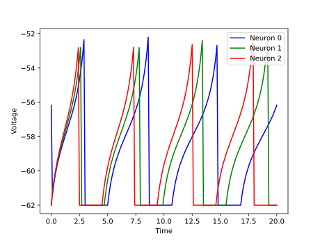
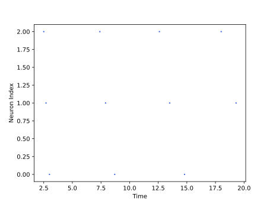

<script type="text/javascript" src="https://www.maths.nottingham.ac.uk/plp/pmadw/LaTeXMathML.js"></script>
<script src='https://cdnjs.cloudflare.com/ajax/libs/mathjax/2.7.4/MathJax.js?config=default'></script>


# AQLIF

## Introduction

The Adaptive Quadratic Leaky Integrate and Fire neuron model is a simplified spiking neuron model. It is a two-variable model that captures the basic dynamics of cortical neurons, while being computationally efficient. The model has gained significant attention in computational neuroscience due to its ability to accurately replicate the spiking patterns of various types of neurons in the brain. In this model, the spiking behavior of a neuron is determined by the interplay of two variables, the membrane potential and a recovery variable, which represents the activity of the potassium ion channels.

<br>

## How does it work?
The Adaptive Quadratic Leaky Integrate and Fire neuron model is a simplified spiking neuron model that aims to capture the essential features of biological neurons while still being computationally efficient. The model consists of two coupled differential equations that describe the membrane potential and the recovery variable of the neuron. The membrane potential is given by the equation:

$$
\begin{align*}
\\
\tau_m\frac{du}{dt}\ = (u(t) - u_{rest}) (u(t) - u_{critical}) - R\sum_{k} w_k + RI(t)
\end{align*}
$$

where $\tau_m$ is the membrane time constant, $u$ is the membrane potential, $u_{rest}$ is the resting potential, $u_{critical}$ is a threshold potential, $R$ is the membrane resistance, $w_k$ is the synaptic weight of the $k^{th}$ input synapse, $I(t)$ is the external current, and $t$ is time.

The recovery variable $w_k$ follows the equation:

$$
\begin{align*}
\\
\tau_k\frac{dw_k}{dt}\ = a_k (u - u_{rest}) - w_k + b_k\tau_k \sum_{t {(f)}} \delta (t - t^{(f)}) \\
\end{align*}
$$

where $\tau_k$ is the time constant for the $k^{th}$ input synapse, $a_k$ and $b_k$ are parameters that determine the dynamics of the recovery variable, and $\sum_{t {(f)}} \delta (t - t^{(f)})$ is a sum over the spikes arriving at the synapse.

The Adaptive Quadratic Leaky Integrate and Fire model has been shown to be capable of reproducing a wide variety of spiking behaviors observed in real neurons, including regular spiking, bursting, and fast spiking, among others. However, the model is still a simplification of the complex dynamics of real neurons, and certain aspects of neural computation may not be captured by the model. Additionally, the model requires careful parameter tuning to reproduce specific spiking behaviors, which can be a time-consuming process.

<br>

## Strengths:
<li>The AQLIF model is computationally efficient and can simulate large networks of spiking neurons.

<li>The model can reproduce a wide range of spiking patterns observed in biological neurons, including regular spiking, fast spiking, and bursting.

<li>The AQLIF model has a simple mathematical formulation that is easy to implement in software and hardware.

<li>The model is based on biophysical principles and can replicate many features of real neurons, such as adaptation and rebound spiking.

<br>

## Weaknesses:
<li>The model makes several simplifying assumptions about the behavior of neurons, such as the lack of dendritic and synaptic processing, which may limit its biological accuracy.

<li>Although the AQLIF model can generate diverse spiking patterns, it may not be able to capture more complex neural dynamics, such as oscillations or synchrony, observed in some neural systems.

<li>The model's behavior is sensitive to its parameters, and finding appropriate values for these parameters can be challenging.

<li>Although the AQLIF model has been widely used in computational neuroscience, its predictions have not been extensively validated experimentally.

<br>

## Usage

 Adaptive Quadratic Leaky Integrate and Fire Population model can be used by the given code:

 ```python

 from synapticflow.network import neural_population

 model = AQLIFPopulation(n=10)

 ```

 Then you can stimulate each time step by calling the `forward` function:

 ```python

 model.forward(torch.tensor([10 for _ in range(model.n)]))

 ```

All available attributes like spike trace and membrane potential are available by `model` instance:

 ```python

 print(model.s) # Model spike trace

 print(model.v) # Model membrane potential

 ```

 And in the same way, you can use the visualization file to draw plots of the obtained answer:

<p align="center">
  
  
</p>

<br>

## Reference

<li> Gerstner, Wulfram, et al. Neuronal dynamics: From single neurons to networks and models of cognition. Cambridge University Press, 2014.

