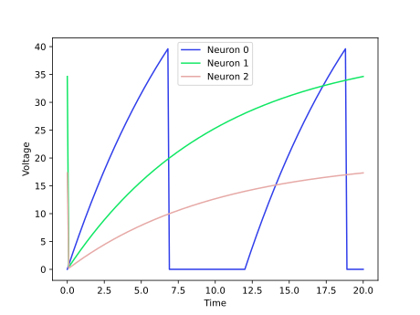
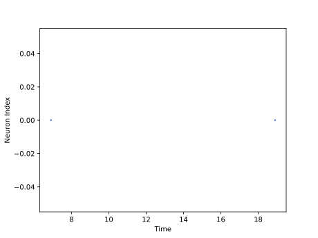

<script type="text/javascript" src="https://www.maths.nottingham.ac.uk/plp/pmadw/LaTeXMathML.js"></script>
<script src='https://cdnjs.cloudflare.com/ajax/libs/mathjax/2.7.4/MathJax.js?config=default'></script>


# Boosted LIF

## Introduction
The Boosted LIF (BLIF) neuron model is a variation of the popular LIF model, which includes a dynamic gain control mechanism to regulate the neuron's firing rate. This allows BLIF neurons to operate with a constant firing rate over a wide range of input stimuli, making them useful in applications such as neural coding and signal processing. The BLIF model is computationally efficient and can be easily implemented in hardware, making it a popular choice in neuromorphic engineering and artificial intelligence research.

<br>

## How does it work?
The Boosted LIF neuron is a modified version of the LIF neuron that includes an additional factor to boost the firing rate of the neuron. The neuron's membrane potential, u, is governed by the differential equation:

$$
\begin{align*}
\\
&\tau_m\frac{du}{dt}\ = -u(t) + RI(t) &\text{if }\quad u(t) \leq u_{th}\\
\end{align*}
$$

where $\tau_m$ is the time constant of the neuron, $R$ is the gain factor, $I(t)$ is the input current at time $t$, $u_{th}$ is the threshold potential, and $u(t)$ is the membrane potential of the neuron at time $t$. If the membrane potential exceeds the threshold potential, the neuron generates a spike and the membrane potential is reset to zero:

$$
\begin{align*}
\\
&u(t) = 0 &\text{otherwise} 
\\
\end{align*}
$$

The residual factor $R$ can be used to control the firing rate of the neuron, with larger values of $R$ resulting in higher firing rates. The Boosted LIF neuron is a simplified model that is computationally efficient and can be used for large-scale simulations. However, it may not capture the full complexity of biological neurons and may not be appropriate for all types of neural computations.

<br>

## Strengths:

<li>Boosted LIF can be implemented using simple mathematical operations, making it computationally efficient and suitable for large-scale simulations.

<br>

<li>By adjusting the parameters of the model, such as the time constant and the gain factor, it is possible to tune the response properties of the neuron to better match experimental observations or desired behavior.

<br>

<li>Boosted LIF can tolerate some amount of noise in the input without significant impact on its output, which can be useful in some contexts.

<br>

## Weaknesses:

<li>Boosted LIF is a simplified model that does not capture all the complex dynamics and mechanisms of real neurons, which may limit its ability to capture certain phenomena.

<br>

<li>Unlike some other models, such as Izhikevich, Boosted LIF does not produce significant spiking variability, which may limit its ability to represent certain types of information or dynamics.

<br>

<li>Boosted LIF does not include mechanisms for synaptic plasticity, which may limit its ability to capture certain types of learning or adaptation.

<br>

## Usage

 Boosted LIF Population model can be used by the given code:

 ```python

 from synapticflow.network import neural_populations

 model = neural_populations.BLIFPopulation(n=10)

 ```

 Then you can stimulate each time step by calling the `forward` function:

 ```python

 model.forward(torch.tensor([10 for _ in range(model.n)]))

 ```

All available attributes like spike trace and membrane potential are available by `model` instance:

 ```python

 print(model.s) # Model spike trace

 print(model.v) # Model membrane potential

 ```

 And in the same way, you can use the visualization file to draw plots of the obtained answer:

<p align="center">
  
  
</p>

<br>

## Reference

<li> Gerstner, Wulfram, et al. Neuronal dynamics: From single neurons to networks and models of cognition. Cambridge University Press, 2014.

