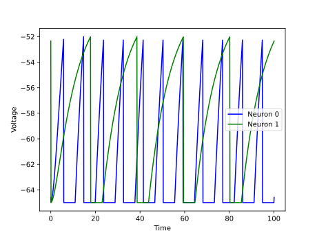
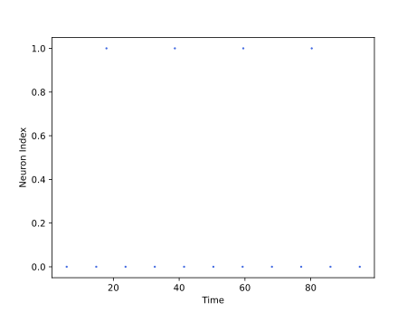

<script type="text/javascript" src="https://www.maths.nottingham.ac.uk/plp/pmadw/LaTeXMathML.js"></script>
<script src='https://cdnjs.cloudflare.com/ajax/libs/mathjax/2.7.4/MathJax.js?config=default'></script>


# Current LIF

## Introduction
The Current-based Leaky Integrate-and-Fire (CLIF) neuron model is a simple yet widely used spiking neuron model in computational neuroscience. Unlike voltage-based LIF models, the current-based LIF model defines the membrane potential as a function of the input current, without taking into account the history of the membrane potential. This makes it computationally efficient and allows for the simulation of large-scale networks of spiking neurons. The current-based LIF model is commonly used in studies of neural coding, synaptic plasticity, and network dynamics, and has been implemented in many software tools for simulating spiking neural networks.

<br>

## How does it work?

The Current-based Leaky Integrate-and-Fire stands for Leaky Integrate-and-Fire neuron model. The CLIF neuron just like the LIF neuron integrates incoming input current $I(t)$ over time and generates a spike when the membrane potential $u(t)$ reaches a certain threshold $u_{th}$. Similar to the ELIF and the LIF model, the CLIF neuron has a resting potential $u_{rest}$ and a membrane time constant $\tau_m$. The membrane potential $u(t)$ of the CLIF neuron obeys the following differential equation:

$$
\begin{align*}
\\
&\tau_m\frac{du}{dt}\ = -[u(t) - u_{rest}] + RI(t) &\text{if }\quad u(t) \leq u_{th}\\
\end{align*}
$$

If the membrane potential $u(t)$ reaches the threshold $u_{th}$, the neuron generates a spike and the membrane potential is reset to the resting potential $u_{rest}$. This is modeled as:

$$
\begin{align*}
&u(t) = u_{rest} &\text{otherwise}\\
\\
\end{align*}
$$

But the CLIF neuron has a big difference with the LIF and that is the amount of its input current because in it we multiply a decay factor in the input current of the previous state and add it to the new input.

## Strengths:

<li>The Current LIF neuron model is very simple and easy to implement, making it a popular choice for neural simulations.

<br>

<li>Since the neuron only responds to incoming current, rather than voltage changes, the Current LIF model can be more energy efficient than other neuron models.

<br>

<li>The Current LIF model can be computed very quickly, making it well-suited for real-time applications.

<br>

<li>The Current LIF model can respond to a variety of input signals, including current, voltage, and conductance inputs.

<br>

## Weaknesses:

<li>The Current LIF model does not accurately capture the behavior of real neurons, particularly with respect to the complex dynamics of action potential generation and propagation.

<br>

<li>The Current LIF model does not incorporate any form of synaptic plasticity, which limits its ability to model learning and adaptation.

<br>

<li>The Current LIF model does not produce spikes, which are the fundamental unit of neural communication. This limits its use in models of neural networks and information processing.

<br>

## Usage

 Current LIF Population model can be used by the given code:

 ```python

 from synapticflow.network import neural_population

 model = CLIFPopulation(n=10)

 ```

 Then you can stimulate each time step by calling the `forward` function:

 ```python

 model.forward(torch.tensor([10 for _ in range(model.n)]))

 ```

All available attributes like spike trace and membrane potential are available by `model` instance:

 ```python

 print(model.s) # Model spike trace

 print(model.v) # Model membrane potential

 ```

 And in the same way, you can use the visualization file to draw plots of the obtained answer:

<p align="center">
  
  
</p>

<br>

## Reference

<li> Gerstner, Wulfram, et al. Neuronal dynamics: From single neurons to networks and models of cognition. Cambridge University Press, 2014.

