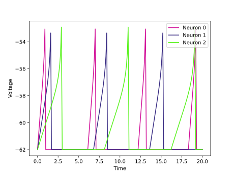
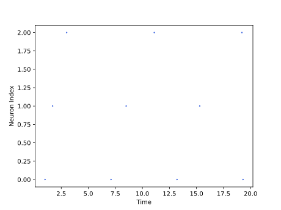

<script type="text/javascript" src="https://www.maths.nottingham.ac.uk/plp/pmadw/LaTeXMathML.js"></script>
<script src='https://cdnjs.cloudflare.com/ajax/libs/mathjax/2.7.4/MathJax.js?config=default'></script>


# ELIF

## Introduction
The Exponential Leaky Integrated-and-Fire (ELIF) neuron model expands on the LIF neuron model by incorporating an exponential function, resulting in more intricate dynamics and a broader array of behaviors. This model is utilized to examine neuron behavior in the brain and has been proven to precisely replicate various facets of actual neuron behavior.
<br>

## How does it work?
The ELIF neuron model is a variation of the LIF model that incorporates a subthreshold depolarizing current. ELIF neurons share similarities with LIF neurons in terms of having both a resting potential and a threshold potential, but their membrane potential dynamics differ slightly. Specifically, the membrane potential of an ELIF neuron can be expressed as:

$$
\begin{align*}
\\
&\tau_m\frac{du}{dt}\ = -[u(t) - u_{rest}] + \Delta_T exp(\frac{u(t) - \theta_{rh}}{\Delta_T}) + RI(t) &\text{if }\quad u(t) \leq u_{th}\\
\end{align*}
$$

$$
\begin{align*}
&u(t) = u_{rest} &\text{otherwise}\\
\\
\end{align*}
$$

If the membrane potential $u$ exceeds the threshold potential $u_{th}$, then the neuron fires a spike, and the membrane potential is reset to the resting potential $u_{rest}$. If $u(t) \leq u_{th}$, the neuron remains in a subthreshold regime, and the dynamics are governed by a subthreshold depolarizing current term $\Delta_T exp(\frac{u(t) - \theta_{rh}}{\Delta_T})$.
The ELIF model provides increased flexibility to the LIF model by enabling the generation of subthreshold depolarizations in response to input. It is also relatively easy to implement and is computationally efficient. However, like the LIF model, the ELIF model has limitations in its ability to accurately represent the intricate dynamics of biological neurons. Specifically, the model does not account for the impact of active membrane properties, such as ion channels, and the subthreshold dynamics are based solely on an exponential function.
<br>

## Strengths:
<li>The ELIF model is an extension of the LIF model, which adds an exponential term to capture subthreshold dynamics. This allows for more accurate modeling of the behavior of real neurons, which may exhibit complex subthreshold dynamics that cannot be captured by the LIF model.
<li>The ELIF model still maintains many of the computational advantages of the LIF model, such as computational efficiency and ease of implementation.
  
## Weaknesses:
<li>The ELIF model is more complex than the LIF model, which may make it more challenging to understand and implement, particularly for non-experts in computational neuroscience.
<br>
  
## Usage
ELIF Population model can be used by the given code:
```python
from synapticflow.network import neural_populations
model = neural_populations.ELIFPopulation(n=10)
```
Then you can stimulate each time step by calling the `forward` function:
```python
model.forward(torch.tensor([10 for _ in range(model.n)]))
```
All available attributes like spike trace and membrane potential are available by `model` instance:
```python
print(model.s) # Model spike trace
print(model.v) # Model membrane potential
```

And in the same way, you can use the visualization file to draw plots of the obtained answer:

<p align="center">
  
  
</p>

<br>
  
## Parameters:

<b>n</b> (<span style="color: #2b8cee; font-style: italic; font-weight: 400;">int, optional</span>) - <span style="font-weight: 400;">Number of neurons in this layer.</span>

<b>shape</b> (<span style="color: #2b8cee; font-style: italic; font-weight: 400;">Iterable[int], optional</span>) - <span style="font-weight: 400;">Shape of the input tensor to the layer.</span>

<b>spike_trace</b> (<span style="color: #2b8cee; font-style: italic; font-weight: 400;">bool, optional</span>) - <span style="font-weight: 400;">Indicates whether to use synaptic traces or not.</span>

<b>additive_spike_trace</b> (<span style="color: #2b8cee; font-style: italic; font-weight: 400;">bool, optional</span>) - <span style="font-weight: 400;">If true, uses additive spike traces instead of multiplicative ones.</span>

<b>tau_s</b> (<span style="color:#2b8cee; font-style: italic; font-weight: 400;">float or torch.Tensor, optional</span>) - <span style="font-weight: 400;">Decay time constant for spike trace. Default : `10`</span>

<b>theta_rh</b> (<span style="color:#2b8cee; font-style: italic; font-weight: 400;">Union[float, torch.Tensor], optional</span>) - <span style="font-weight: 400;">A float or tensor representing the resting potential value for neuron model.</span>

<b>delta_T</b> (<span style="color:#2b8cee; font-style: italic; font-weight: 400;">Union[float, torch.Tensor], optional</span>) - <span style="font-weight: 400;">A float or tensor representing sharpness of the neuron's voltage threshold.</span>

<b>threshold</b> (<span style="color:#2b8cee; font-style: italic; font-weight: 400;">float or torch.Tensor, optional</span>) - <span style="font-weight: 400;">The spike threshold of the neuron.</span>

<b>rest_pot</b> (<span style="color: #2b8cee; font-style: italic; font-weight: 400;">float or torch.Tensor, optional</span>) - <span style="font-weight: 400;">The resting potential of the neuron.</span>

<b>reset_pot</b> (<span style="color: #2b8cee; font-style: italic; font-weight: 400;">float or torch.Tensor, optional</span>) - <span style="font-weight: 400;">The reset potential of the neuron.</span>

<b>refrac_length</b> (<span style="color: #2b8cee; font-style: italic; font-weight: 400;">float or torch.Tensor, optional</span>) - <span style="font-weight: 400;">The refractory period length of the neuron in timesteps.</span>

<b>dt</b> (<span style="color: #2b8cee; font-style: italic; font-weight: 400;">float, optional</span>) - <span style="font-weight: 400;">The time step length.</span>

<b>lower_bound</b> (<span style="color: #2b8cee; font-style: italic; font-weight: 400;">float, optional</span>) - <span style="font-weight: 400;">Minimum value for the membrane potential of the neuron.</span>

<b>sum_input</b> (<span style="color: #2b8cee; font-style: italic; font-weight: 400;">bool, optional</span>) - <span style="font-weight: 400;">If true, sums input instead of averaging it.</span>

<b>trace_scale</b> (<span style="color: #2b8cee; font-style: italic; font-weight: 400;">float, optional</span>) - <span style="font-weight: 400;">Scaling factor for the synaptic traces.</span>

<b>is_inhibitory</b> (<span style="color: #2b8cee; font-style: italic; font-weight: 400;">bool, optional</span>) - <span style="font-weight: 400;">Indicates whether the neuron is inhibitory or not.</span>

<b>R</b> (<span style="color: #2b8cee; font-style: italic; font-weight: 400;">Union[float, torch.Tensor], optional</span>) - <span style="font-weight: 400;">The time constant of the neuron voltage decay.</span>

<b>learning</b> (<span style="color: #2b8cee; font-style: italic; font-weight: 400;">bool, optional</span>) - <span style="font-weight: 400;">Indicates whether the neuron should update its weights during training.</span>

  
## Reference
<li> Gerstner, Wulfram, et al. Neuronal dynamics: From single neurons to networks and models of cognition. Cambridge University Press, 2014.
