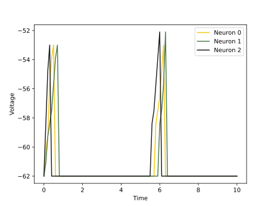

<script type="text/javascript" src="https://www.maths.nottingham.ac.uk/plp/pmadw/LaTeXMathML.js"></script>
<script src='https://cdnjs.cloudflare.com/ajax/libs/mathjax/2.7.4/MathJax.js?config=default'></script>


# IF

## Introduction
The Integrate-and-Fire (IF) neuron model is a simple but effective mathematical model used to simulate the behavior of individual neurons in the brain. IF model assumes that a neuron integrates incoming electrical signals from other neurons and fires a spike of electrical activity when its membrane potential reaches a certain threshold value. The IF model has been widely used in computational neuroscience to understand the dynamics of single neurons and to build larger-scale neural networks.

<br>

## How does it work?
The Integrate-and-Fire (IF) neuron model is a simplified version of the LIF model that only considers the neuron's membrane potential crossing a fixed threshold. In this model, the membrane potential is assumed to increase linearly with the input current, and once it reaches the threshold value, the neuron fires a spike and the membrane potential is reset to the resting potential. The dynamics of the IF model can be described by the following equations:

$$
\begin{align*}
\\
&\tau_m\frac{du}{dt}\ = RI(t) &\text{if }\quad u(t) \leq u_{th}\\
\end{align*}
$$

$$
\begin{align*}
&u(t) = u_{rest} &\text{otherwise}\\
\\
\end{align*}
$$

where $u(t)$ is the membrane potential at time $t$, $u_{rest}$ is the resting potential, $u_{th}$ is the threshold potential, $R$ is the membrane resistance, $I(t)$ is the input current, and $\tau_m$ is the membrane time constant. If the membrane potential reaches the threshold value, a spike is emitted and the membrane potential is reset to the resting potential. The IF model is computationally efficient and can be used for large-scale simulations, but it lacks the ability to accurately model the neuron's subthreshold behavior and the effect of synaptic inputs on the membrane potential.

<br>

## Strengths:
<li>The IF neuron model is simple and computationally efficient, making it suitable for large-scale simulations.

<li>The model is capable of generating spike trains that exhibit certain statistical properties observed in real neurons, such as Poisson-like or regular firing.

<li>The IF neuron is often used in theoretical neuroscience to model the behavior of populations of neurons.

<br>

## Weaknesses:
<li>The IF model ignores many of the complex dynamics that are present in real neurons, such as spike-frequency adaptation, sub-threshold oscillations, and other nonlinear effects.

<li>The model assumes that the membrane potential of the neuron can be accurately described by a single scalar value, which is not always the case.

<li>The IF neuron model is unable to capture the dynamics of some important phenomena in neuroscience, such as the generation of action potentials, synaptic plasticity, and dendritic processing.

<br>

## Usage

 IF Population model can be used by given code:
 ```python
 from synapticflow.network import neural_populations
 model = IFPopulation(n=10)
 ```

 Then you can stimulate each time step by calling `forward` function:
 ```python
 model.forward(torch.tensor([10 for _ in range(model.n)]))
 ```

 All available attributes like spike trace and membrane potential is available by `model` instance:
 ```python
 print(model.s) # Model spike trace
 print(model.v) # Model membrane potential
 ```

 And in the same way, you can use the visualization file to draw plots of the obtained answer:

<p align="center">
  
  
</p>

<br>

## Reference
<li> Wikipedia
<li> Scholarpedia
