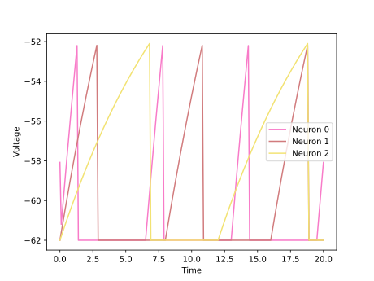
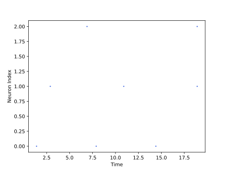

<script type="text/javascript" src="https://www.maths.nottingham.ac.uk/plp/pmadw/LaTeXMathML.js"></script>
<script src='https://cdnjs.cloudflare.com/ajax/libs/mathjax/2.7.4/MathJax.js?config=default'></script>


# LIF

## Introduction

The Leaky Integrate-and-Fire (LIF) neuron model is one of the simplest and most commonly used neuron models in computational neuroscience. The LIF model consists of a simple linear differential equation that describes the neuron’s membrane potential, which integrates incoming synaptic inputs until it reaches a threshold, at which point the neuron “fires” a spike and resets its membrane potential. Despite its simplicity, the LIF model has been shown to accurately capture many essential aspects of real neural behavior, such as spike timing and synchronization, and is widely used in both theoretical and experimental neuroscience. As such, the LIF model is a valuable tool for studying the behavior of neurons and neural networks in the brain.

<br>

## How does it work?

LIF stands for Leaky Integrate-and-Fire neuron model. It is a simplified version of the ALIF model. LIF neuron integrates incoming input current $I(t)$ over time and generates a spike when the membrane potential $u(t)$ reaches a certain threshold $u_{th}$. Similar to the ALIF model, the LIF neuron has a resting potential $u_{rest}$ and a membrane time constant $\tau_m$. However, the LIF neuron does not have the adaptation term and the threshold reset mechanism that the ALIF model has. Therefore, the membrane potential $u(t)$ of the LIF neuron obeys the following differential equation:

$$
\begin{align*}
\\
&\tau_m\frac{du}{dt}\ = -[u(t) - u_{rest}] + RI(t) &\text{if }\quad u(t) \leq u_{th}\\
\end{align*}
$$

If the membrane potential $u(t)$ reaches the threshold $u_{th}$, the neuron generates a spike and the membrane potential is reset to the resting potential $u_{rest}$. This is modeled as:

$$
\begin{align*}
&u(t) = u_{rest} &\text{otherwise}\\
\\
\end{align*}
$$

The LIF neuron model is widely used in computational neuroscience and is computationally efficient due to its simplicity. However, it does not capture the dynamics of spiking behavior as accurately as more complex models like ALIF.

<br>

<div class="sidebar-logo-container">
  <p align="center">
    
    
  </p>
</div>

<br>

## Strengths:

<li>The LIF model is one of the simplest and most computationally efficient neuron models available, making it a valuable tool for simulating large-scale neural networks.

<br>

<li>The LIF model has been shown to accurately capture many important aspects of real neural behavior, such as spike timing and synchronization, and has been used successfully in a wide variety of theoretical and experimental neuroscience studies.

<br>

<li>The simplicity of the LIF model makes it easy to understand and implement, even for non-experts in the field of computational neuroscience.

<br>

## Weaknesses:

<li>The LIF model does not account for many important aspects of real neural behavior, such as adaptation, spike frequency adaptation, and subthreshold dynamics, which may limit its usefulness in certain contexts.

<li>The LIF model assumes spikes are instantaneous, which may not be a realistic assumption for all types of neurons.

<br>

## Usage

 LIF Population model can be used by the given code:

 ```python

 from synapticflow.network import neural_populations

 model = neural_populations.LIFPopulation(n=10)

 ```

 Then you can stimulate each time step by calling the `forward` function:

 ```python

 model.forward(torch.tensor([10 for _ in range(model.n)]))

 ```

All available attributes like spike trace and membrane potential are available by `model` instance:

 ```python

 print(model.s) # Model spike trace

 print(model.v) # Model membrane potential

 ```

And in the same way, you can use the visualization file to draw plots of the obtained answer:

<p align="center">
  
  
</p>

<br>
  
## Parameters:
    
    - n : int, optional
        Number of neurons in this layer.
    - shape : Iterable[int], optional
        Shape of the input tensor to the layer.
    - spike_trace : bool, optional
        Indicates whether to use synaptic traces or not.
    - additive_spike_trace : bool, optional
        If true, uses additive spike traces instead of multiplicative ones.
    - tau_s : float or torch.Tensor, optional
        Decay time constant for spike trace (default value is 10.)
    - threshold : float or torch.Tensor, optional
        The spike threshold of the neuron.
    - rest_pot : float or torch.Tensor, optional
        The resting potential of the neuron.
    - reset_pot : float or torch.Tensor, optional
        The reset potential of the neuron.
    - refrac_length : float or torch.Tensor, optional
        The refractory period length of the neuron in timesteps.
    - dt : float, optional
        The time step length.
    - lower_bound : float, optional
        Minimum value for the membrane potential of the neuron.
    - sum_input : bool, optional
        If true, sums input instead of averaging it.
    - trace_scale : float, optional
        Scaling factor for the synaptic traces.
    - is_inhibitory : bool, optional
        Indicates whether the neuron is inhibitory or not.
    - tau_decay : float or torch.Tensor, optional
        The time constant of the neuron voltage decay.
    - learning : bool, optional
        Indicates whether the neuron should update its weights during training.
  
    - Returns:
        None

## Reference

<li> Gerstner, Wulfram, et al. Neuronal dynamics: From single neurons to networks and models of cognition. Cambridge University Press, 2014.

