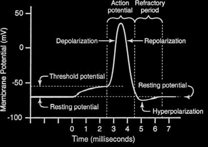

<script src=’https://cdnjs.cloudflare.com/ajax/libs/mathjax/2.7.4/MathJax.js?config=default’></script>

# LIF

## Introduction

The Leaky Integrate and Fire (LIF) neuron model is one of the simplest and most commonly used neuron models in computational neuroscience. The LIF model consists of a simple linear differential equation that describes the neuron’s membrane potential, which integrates incoming synaptic inputs until it reaches a threshold, at which point the neuron “fires” a spike and resets its membrane potential. Despite its simplicity, the LIF model has been shown to accurately capture many essential aspects of real neural behavior, such as spike timing and synchronization, and is widely used in both theoretical and experimental neuroscience. As such, the LIF model is a valuable tool for studying the behavior of neurons and neural networks in the brain.

<br>

## How does it work?

A *membrane equation* and a *reset condition* define our *leaky-integrate-and-fire (LIF)* neuron:

<br>

$$

\begin{align*}

\\

&\tau_m\frac{du}{dt}\ = -[u(t) - u_{rest}] + RI(t) &\text{if }\quad u(t) \leq u_{th}\\

\end{align*}

$$

$$

\begin{align*}

&u(t) = u_{rest} &\text{otherwise}\\

\\

\end{align*}

$$

where $u(t)$ is the membrane potential, $\tau_m$ is the membrane time constant which is equal to $RC$, it is the characteristic time of the decay, $R$ is the membrane resistance, $C$ is the capacity of the capacitor, $I(t)$ is the synaptic input current, $u_{th}$ is the spiking threshold, and $u_{rest}$ is the resting potential.

The membrane equation is an *ordinary differential equation (ODE)* that illustrates the time evolution of membrane potential $u(t)$ in response to synaptic input and leaking of change across the cell membrane.

To solve this ODE, we can apply the forward Euler method to solve the ODE with a given initial value. We simulate the evolution of the membrane equation in discrete time steps with a sufficiently small $\Delta t$. We start by writing the time derivative $\frac{du}{dt}$ in the membrane equation without taking the limit $\Delta t \to 0$:

$$

\begin{align*}

\\

\tau_m\frac{ u(t+\Delta t)-u(t)}{\Delta t}\ = -[u(t) - u_{rest}] + RI(t)

\\

\\

\end{align*}

$$

The equation can be transformed into the following well-formed equation:

$$

\begin{align*}

\\

u(t+\Delta t) = u(t)-\frac{\Delta t}{\tau_m} \left( [u(t) - u_{rest}] - RI(t) \right)

\\

\\

\end{align*}

$$

The value of membrane potential $u(t+\Delta t)$ can be expressed in terms of its previous value $u(t)$ by simple algebraic manipulation. For *small enough* values of $\Delta t$, this provides a good approximation of the continuous-time integration.

Another concept to be considered is the refractory period. After the action potential occurs, however, there is a short period of refractoriness, which affects neuron firing. During the first part of the refractory period (the absolute refractory period), the neuron will not fire again, no matter how great the stimulation. 

<br>

<div class="sidebar-logo-container">

  <p align="center">

    

    

  </p>

</div>

<br>

## Strengths:

<li>The LIF model is one of the simplest and most computationally efficient neuron models available, making it a valuable tool for simulating large-scale neural networks.

<br>

<li>The LIF model has been shown to accurately capture many important aspects of real neural behavior, such as spike timing and synchronization, and has been used successfully in a wide variety of theoretical and experimental neuroscience studies.

<br>

<li>The simplicity of the LIF model makes it easy to understand and implement, even for non-experts in the field of computational neuroscience.

<br>

## Weaknesses:

<li>The LIF model does not account for many important aspects of real neural behavior, such as adaptation, spike frequency adaptation, and subthreshold dynamics, which may limit its usefulness in certain contexts.

<li>The LIF model assumes spikes are instantaneous, which may not be a realistic assumption for all types of neurons.

<br>

## Usage

 LIF Population model can be used by the given code:

 ```python

 from synapticflow.network import neural_population

 model = LIFPopulation(n=10)

 model.set_batch_size(10)

 ```

 Then you can stimulate each time step by calling the `forward` function:

 ```python

 model.forward(torch.tensor([10 for _ in range(model.n)]))

 ```

All available attributes like spike trace and membrane potential are available by `model` instance:

 ```python

 print(model.s) # Model spike trace

 print(model.v) # Model membrane potential

 ```

<br>

## Reference

<li> Wikipedia

<li> Scholarpedia

