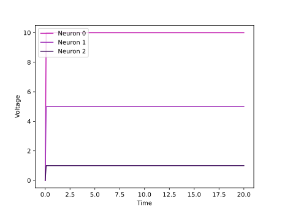
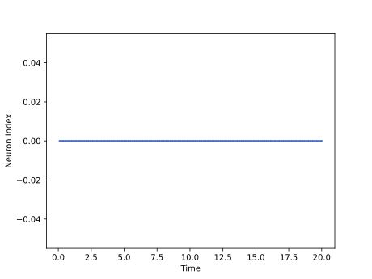

<script type="text/javascript" src="https://www.maths.nottingham.ac.uk/plp/pmadw/LaTeXMathML.js"></script>
<script src='https://cdnjs.cloudflare.com/ajax/libs/mathjax/2.7.4/MathJax.js?config=default'></script>


# McCulloch Pitts Neuron Model

## Introduction
The McCulloch-Pitts neuron model, also known as the threshold logic unit (TLU), is a simplified mathematical model of a biological neuron that was proposed by Warren McCulloch and Walter Pitts in 1943. The model captures the basic principles of neuron activation and signal transmission in the brain, and serves as a fundamental building block for artificial neural networks. In the McCulloch-Pitts model, the input signals are binary values (0 or 1), and the neuron computes a weighted sum of these inputs. If the sum exceeds a threshold value, the neuron outputs a binary 1; otherwise, it outputs 0. The simplicity and versatility of the McCulloch-Pitts model have made it an important tool for understanding and simulating neural processing in both biological and artificial systems.

## How does it work
The McCulloch-Pitts neuron model works by setting membrane potential of neuron to input current and check if membrane potential reached to potential threshold or not. Mathematically, we can consider input current as $I(t)$ as a function of time. Due to TLU dynamic we have: 
$$u(t) = I(t)$$
For each iteration, membrane potential will be checked by this formula: 
$$
\begin{cases}
1 \,\,\,\,\, u(t) \ge \theta \\
0 \,\,\,\,\, U(t) < \theta
\end{cases}
$$

## Strengths and Weaknesses
 One of the strengths of this model is its simplicity, which allows for easy implementation and interpretation. Additionally, it can perform simple logical operations such as AND, OR, and NOT. However, one of its weaknesses is that it cannot handle more complex tasks, such as pattern recognition or decision making, and it does not take into account the time dimension of neural activity. Despite these limitations, the McCulloch-Pitts model laid the foundation for more advanced neural network models that are capable of solving more complex problems.

 ## Usage

 McCulloch-Pitts model can be used by given code:
 ```python
 from synapticflow.network import neural_populations
 model = neural_populations.McCullochPitts(n=10)
 model.set_batch_size(10)
 ```

 Then you can stimulate each time step by calling `forward` function:
 ```python
 model.forward(torch.tensor([10 for _ in range(model.n)]))
 ```

 All available attributes like spike trace and membrane potential is available by `model` instance:
 ```python
 print(model.s) # Model spike trace
 print(model.v) # Model membrane potential
 ```

 And in the same way, you can use the visualization file to draw plots of the obtained answer:

<p align="center">
  
  
</p>

 ## References
 - <a href="https://towardsdatascience.com/mcculloch-pitts-model-5fdf65ac5dd1"> Towards Data Science: McCulloch-Pitts Neuron</a>
