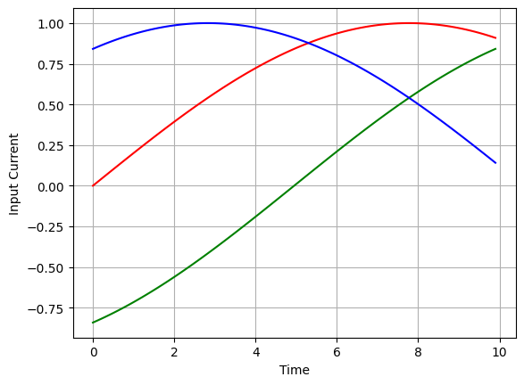
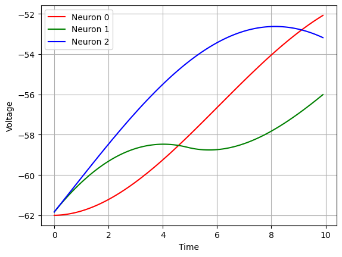
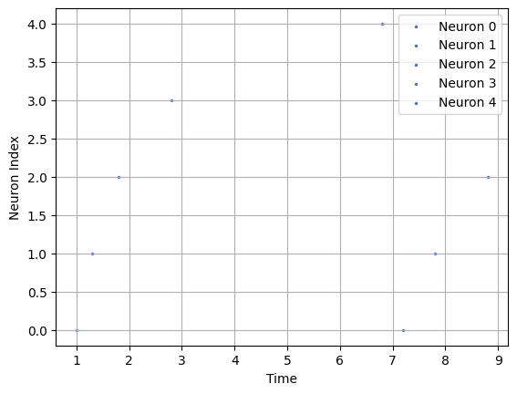
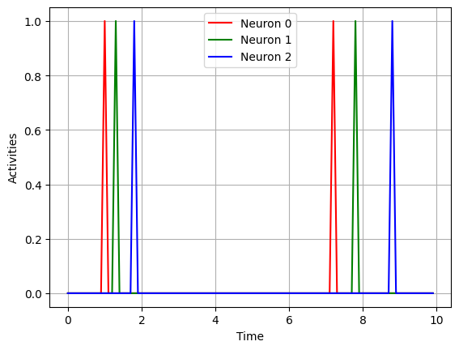
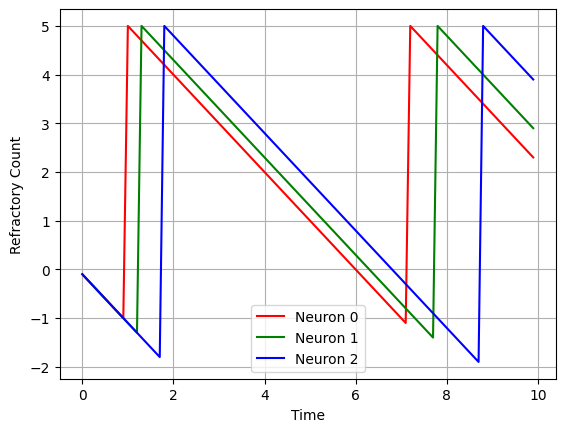
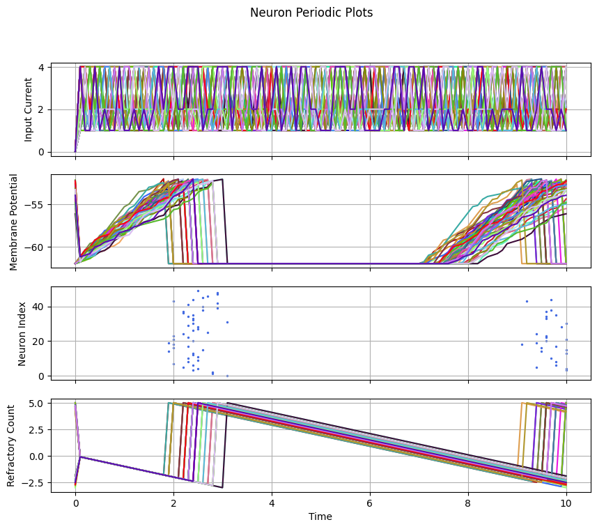
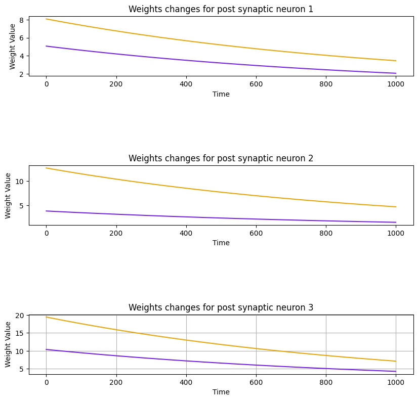

# Visualization

## Introduction:
Data visualization is an essential tool for any neuroscientist who wishes to gain insights into complex phenomena. In the field of computational neuroscience, where large quantities of data are generated through simulations or experiments, effective visualization techniques are especially important for understanding and communicating results. Plots and charts can help reveal patterns and relationships that might be difficult to discern from raw data alone. They can also aid in hypothesis testing and model validation. In this section, we will explore some common types of plots used in computational neuroscience and the insights they can provide.

## Table of Contents:
- plot_current
- plot_potential
- plot_activity
- raster_plot
- plot_weights
- plot_refractory_count
- plot_neuron
- plot_periodic

## plot_current:
```python
plot_current(currents: List[torch.Tensor], dt: float, save_path: str = None, legend: bool = False, default_colors: List = None)
```
### Parameters:
- currents: (List[torch.Tensor]) List of tensors which represent input current.
- dt: (float) Number indicates $dt$.
- save_path: (str = None) Indicates plot save path. In default mode, it doesn't save plot.
- legend: (bool = False) Indicates whether to add legend.
- default_colors: (List) List of strings which each string presents color of that specific neuron.

### Example:
```python
import torch
import synapticflow as sf
X1 = torch.sin(torch.linspace(0, 2, steps=100))
X2 = torch.sin(torch.linspace(-1, 1, steps=100))
X3 = torch.sin(torch.linspace(1, 3, steps=100))
X = [torch.tensor([X1[i], X2[i], X3[i]]) for i in range(len(X1))]
sf.plot_current(X, 0.1, default_colors=['red', 'green', 'blue'])
```


## plot_potential:
```python
plot_potential(population_potentials: List[torch.tensor], dt: float, threshold: float = None, save_path: str = None, legend: bool = False, default_colors: List = None)
```

### Parameters:
- population_potentials: (List[torch.tensor]) List of tensors which represent population potential.
- dt: (float) Indicates $dt$ in computations
- threshold: (float = None) Indicates neural population's threshold. If it sets to `None`, then threshold won't be appeared in plot.
- save_path: (str = None) Indicates plot save path. In default mode, it doesn't save plot.
- legend: (bool = False) Indicates whether to add legend.
- default_colors: (List) List of strings which each string presents color of that specific neuron.

### Examples:
```python
# Import required libraries
import torch
import synapticflow as sf
import copy

# Create arbitrary input current
X1 = torch.abs(torch.sin(torch.linspace(0, 2, steps=100)))
X2 = torch.abs(torch.sin(torch.linspace(-1, 1, steps=100)))
X3 = torch.abs(torch.sin(torch.linspace(1, 3, steps=100)))
X = [torch.tensor([X1[i], X2[i], X3[i]]) for i in range(len(X1))]

# Record voltages through iterations
model = sf.LIFPopulation(n=3)
voltages = []
for i in range(len(X)):
    model.forward(X[i])
    voltages.append(copy.deepcopy(model.v))

# Plot potential
sf.plot_potential(voltages, dt=0.1, default_colors=['red', 'green', 'blue'], legend=True)
```



## raster_plot:

```python
raster_plot(population_spikes: List[torch.Tensor], dt: float, save_path: str = None, legend: bool = False)
```
### Parameters:
- population_spikes: (List[torch.Tensor]) List of neurons spike trace in time
- dt: (float) Indicates $dt$ in computations
- save_path: (str = None) Indicates plot save path. In default mode, it doesn't save plot.
- legend: (bool = False) Indicates whether to add legend.

### Example:
```python
import torch
import synapticflow as sf
model = sf.LIFPopulation(n=5)
spikes = []
tim = 10
while(tim > 0):
    model.forward(torch.tensor([5, 4, 3, 2, 1]))
    tim -= model.dt
    spikes.append(model.s)
sf.raster_plot(spikes, dt=model.dt, legend=True)
```



## plot_activity:

```python
plot_activity(population_spikes: List[torch.Tensor], dt: float, save_path: str = None, legend: bool = False, default_colors: List = None)
```

### Parameters:
- population_spikes: (List[torch.Tensor]) List of neurons spike trace in time
- dt: (float) Indicates $dt$ in computations
- save_path: (str = None) Indicates plot save path. In default mode, it doesn't save plot.
- legend: (bool = False) Indicates whether to add legend.
- default_colors: (List = None) List of strings which each string presents color of that specific neuron.

### Example:
```python
import torch
import synapticflow as sf
model = sf.LIFPopulation(n=3)
spikes = []
tim = 10
while(tim > 0):
    model.forward(torch.tensor([5, 4, 3]))
    tim -= model.dt
    spikes.append(model.s)
sf.plot_activity(spikes, dt=model.dt, legend=True, default_colors=['red', 'green', 'blue'])
```


## plot_refractory_count:

```python
plot_refractory_count(population_refracts: List[torch.tensor], dt: float, save_path: str = None, legend: bool = False, default_colors: List = None)
```

### Parameters:
- population_refracts: (List[torch.tensor]) List of neurons refractory count trace in time.
- dt: (float) Indicates $dt$ in computations.
- save_path: (str = None) Indicates plot save path. In default mode, it doesn't save plot.
- legend: (bool = False) Indicates whether to add legend.
- default_colors: (List = None) List of strings which each string presents color of that specific neuron.

### Example:
```python
import torch
import copy
import synapticflow as sf

model = sf.LIFPopulation(n = 3)
refracts = []
tim = 10
while (tim > 0):
    model.forward(torch.tensor([5,4,3]))
    refracts.append(copy.deepcopy(model.refrac_count))
    tim -= model.dt
sf.plot_refractory_count(refracts, dt=model.dt, legend=True, default_colors=['red', 'green', 'blue'])
```


## plot_neuron:
```python
plot_neuron(neural_population: NeuralPopulation, input_current: List[torch.tensor], dt: float, threshold: float = None, does_plot_current: bool = True, does_plot_potential: bool = True, does_plot_refractory: bool = True, does_plot_activity: bool = True, save_path: str = None, legend: bool = False, colors: List = None)
```
### Parameters:
- neural_population: (NeuralPopulation) Neural population.
- input_current: (List[torch.tensor]) List of neurons input current trace in time.
- dt: (float) Indicates $dt$ in computations.
- threshold: (float = None) Indicates threshold of neurons potential.
- does_plot_current: (bool = True) Indicates whether to plot neurons input current.
- does_plot_potential: (bool = True) Indicates whether to plot neurons potential.
- does_plot_refractory: (bool = True) Indicates whether to plot neurons refractory count.
- does_plot_activity: (bool = True) Indicates whether to plot neurons activity.
- save_path: (str = None) Indicates plot save path. In default mode, it doesn't save plot.
- legend: (bool = False) Indicates whether to add legend.
- colors: (List = None) List of strings which each string presents color of that specific neuron.

### Example:
```python
import torch
import synapticflow as sf

model = sf.LIFPopulation(n=5)
input_current = [torch.tensor([5,4,3,2,1]) for _ in range(1000)]
sf.plot_neuron(neural_population=model, input_current=input_current, dt=model.dt, threshold=model.pot_threshold, colors=['red', 'green', 'blue', 'orange', 'brown'])
```


## plot_periodic:
```python
plot_periodic(data: dict, dt: float, threshold: float = None, save_path: str = None, legend: bool = False)
```
### Parameters:
- data: (dict) A dictionary in a specific format: data = {<time> : {<spike> : [], <voltage> : [], <refract> : [], <current> : []}}
- dt : (float) Indicates $dt$ in computations.
- threshold: (float = None) Indicates threshold of neurons potential.
- save_path: (str = None) Indicates plot save path. In default mode, it doesn't save plot.
- legend: (bool = False) Indicates whether to add legend.

### Example:
```python
import torch
import copy
import synapticflow as sf

model = sf.LIFPopulation(n=50)
tim = 10
spikes = [model.s]
voltages =[model.v]
refracts = [model.refrac_count]
data = {}
d = {}
d['spike'] = model.s
d['voltage'] = model.v
d['refract'] = model.refrac_count
d['current'] = torch.tensor([0 for _ in range(50)])
data[10-tim] = d
while (tim > 0):
    c = torch.tensor([random.choice([4,2,1]) for _ in range(50)])
    model.forward(c)
    tim -= model.dt
    spikes.append(model.s)
    voltages.append(copy.deepcopy(model.v))
    refracts.append(copy.deepcopy(model.refrac_count))
    d = {}
    d['spike'] = copy.deepcopy(model.s)
    d['voltage'] = copy.deepcopy(model.v)
    d['refract'] = copy.deepcopy(model.refrac_count)
    d['current'] = c
    data[10-tim] = d
sf.plot_periodic(data, dt=0.1)
```


## plot_weights:
```python
plot_weights(weights: List[torch.Tensor], dt: float, save_path: str = None)
```
### Parameters:
- weights: (List[torch.Tensor]) List of weights.
- dt : (float) Indicates $dt$ in computations.
- save_path: (str = None) Indicates plot save path. In default mode, it doesn't save plot.

### Examples:
```python
n1 = sf.LIFPopulation(3, refrac_length=0)
n2 = sf.LIFPopulation(2, refrac_length=0)

connection = sf.Connection(pre = n1, post = n2, w_min=0, w_max=20)
learning_rule = sf.MNSTDP(connection, lr = [0.0002, 0.0003], A_positive=0.01, A_negative=0.01, tau_positive=0.25, tau_negative=0.25, weight_decay=0.0001)
weights = []
for i in range(10000):
    n1.forward(torch.tensor([6, 1, 2]))
    n2.forward(torch.tensor([6, 2]))
    learning_rule.update()
    weights.append(copy.deepcopy(connection.w))

sf.plot_weights(weights, dt=n1.dt)
```

