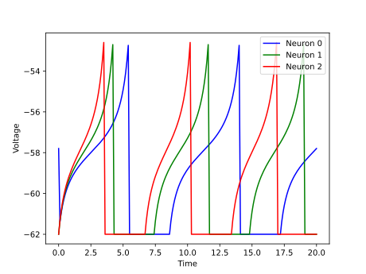

<script type="text/javascript" src="https://www.maths.nottingham.ac.uk/plp/pmadw/LaTeXMathML.js"></script>
<script src='https://cdnjs.cloudflare.com/ajax/libs/mathjax/2.7.4/MathJax.js?config=default'></script>


# QLIF

## Introduction
The Quadratic Integrate-and-Fire (QLIF) neuron model is a simple yet effective spiking neuron model that is widely used in computational neuroscience. The QLIF model is an extension of the LIF model, where the quadratic term in the membrane potential is taken into account to capture the subthreshold nonlinearity. This allows for more accurate modeling of spiking behavior and adaptation in biological neurons. In this model, the membrane potential of a neuron evolves linearly in time in the subthreshold regime and is reset to a fixed value after a spike.


<br>

## How does it work?
The quadratic integrate-and-fire (QLIF) neuron model is a variation of the LIF model that takes into account the fact that the firing rate of a neuron may depend on the input current in a nonlinear way. The QLIF neuron model assumes that the firing rate of the neuron is proportional to the square root of the membrane potential difference between the threshold potential and the resting potential, rather than being simply proportional to this difference, as in the LIF model.

The QLIF model has a quadratic term in the membrane equation that makes it nonlinear, and it allows for a more accurate description of spiking behavior in some biological neurons. The membrane equation of the QLIF neuron model can be written as:

$$
\begin{align*}
\\
&\tau_m\frac{du}{dt}\ = a_0(u(t) - u_{rest}) (u(t) - u_{critical}) + RI(t) &\text{if }\quad u(t) \leq u_{th}\\
\end{align*}
$$

$$
\begin{align*}
&u(t) = u_{rest} &\text{otherwise}\\
\\
\end{align*}
$$

To simulate the QLIF neuron model, we can use a similar approach to the LIF model. We solve the membrane equation using the forward Euler method, but we modify the update rule to include the nonlinear quadratic term. For small enough time steps, this approach provides a good approximation of the continuous-time integration of the membrane potential.

<br>

## Strengths:
<li>QLIF models are computationally efficient and simple, allowing for simulations of large-scale neural networks.

<li>The spiking behavior of QLIF neurons is highly precise, making it useful in modeling systems that require precise timing, such as auditory processing.

<li>QLIF models can be extended to include synaptic plasticity and learning, making them useful in modeling complex neural systems.

<br>

## Weaknesses:
<li>QLIF models assume that the input current is constant during the interspike interval, which is not always the case in real neural systems.

<li>QLIF models do not account for the effect of subthreshold voltage fluctuations on spike timing, which can be important in certain neural systems.

<li>The simplicity of the QLIF model may not capture the full complexity of real neural systems, limiting its usefulness in certain contexts.

<br>

## Usage

 QLIF Population model can be used by given code:
 ```python
 from synapticflow.network import neural_populations
 model = neural_populations.QLIFPopulation(n=10)
 ```

 Then you can stimulate each time step by calling `forward` function:
 ```python
 model.forward(torch.tensor([10 for _ in range(model.n)]))
 ```

 All available attributes like spike trace and membrane potential is available by `model` instance:
 ```python
 print(model.s) # Model spike trace
 print(model.v) # Model membrane potential
 ```

And in the same way, you can use the visualization file to draw plots of the obtained answer:

<p align="center">
  
  
</p>

<br>

## Reference
<li> Wikipedia
<li> Scholarpedia
